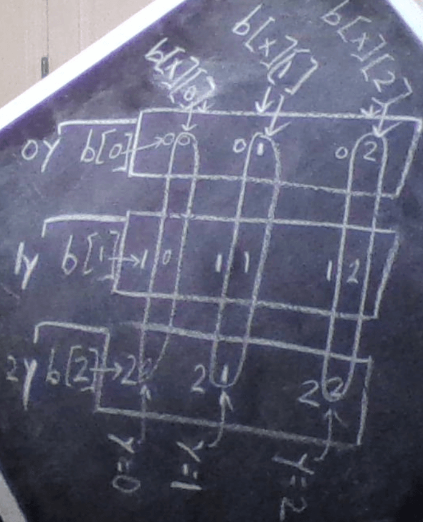

## Multiple README files Explanation
There are currently 3 README files:
1. This one, README.md is the main README here in root directory
2. [README2.md](readme_for_template/README2.md) is the second README, which comes with the [Template](https://github.com/Code-Institute-Org/python-essentials-template) used
3. [README3_from_original_repo_pre_template.md](readme_2_and_3/readme3_from_original_repo_pre_template/README3_from_original_repo_pre_template.md) is the third README, which comes from the original [Portfolio_Project_3](readme_2_and_3/readme3_from_original_repo_pre_template/README3_from_original_repo_pre_template.md) Repository used before restarting using [Template](https://github.com/Code-Institute-Org/python-essentials-template) to allow front end use and display of python application

## Other .md markdown files in project

- [README2.md](assets/documentation/readme_2_and_3/template_readme2/README2.md)
- [README3_from_original_repo_pre_template.md](assets/documentation/readme_2_and_3/readme3_from_original_repo_pre_template/README3_from_original_repo_pre_template.md)
- [CODE_VISUALISATION.md](assets/documentation/supplementary_files_to_main_readme_file/non_testing_supplementary_files_for_main_readme/CODE_VISUALISATION.md)
- [DEBUG.md](assets/documentation/supplementary_files_to_main_readme_file/non_testing_supplementary_files_for_main_readme/DEBUG.md)
- [DEVELOPMENT.md](assets/documentation/supplementary_files_to_main_readme_file/non_testing_supplementary_files_for_main_readme/DEVELOPMENT.md)
- [NOTES.md](assets/documentation/supplementary_files_to_main_readme_file/non_testing_supplementary_files_for_main_readme/NOTES.md)
- [PLAN.md](assets/documentation/supplementary_files_to_main_readme_file/non_testing_supplementary_files_for_main_readme/PLAN.md)
- [REFERENCES_unformatted.md](assets/documentation/supplementary_files_to_main_readme_file/non_testing_supplementary_files_for_main_readme/REFERENCES_unformatted.md)
- [TESTING.md](assets/documentation/supplementary_files_to_main_readme_file/testing_files/TESTING.md)
- [TESTING2_excluded_debug.md](assets/documentation/supplementary_files_to_main_readme_file/testing_files/testing2_excluded_debug_files/TESTING2_excluded_debug.md)
- [TESTING3.md](assets/documentation/supplementary_files_to_main_readme_file/testing_files/TESTING3.md)
- [TESTING4.md](assets/documentation/supplementary_files_to_main_readme_file/testing_files/TESTING4.md)

## file locations of markdown .md files not in root folder

- [TESTING2_excluded_debug.md](assets/documentation/TESTING2_excluded_debug_files/TESTING2_excluded_debug.md)
- [README2.md](readme_for_template/README2.md)
- [README3_from_original_repo_pre_template.md](readme_for_template/README3_from_original_repo_pre_template/README3_from_original_repo_pre_template.md)

## Development Continued

### Phase 0
Error present in terminal: 
- flake8 error E231 
- Fixed by using: [flake8 error E231 after a successful black run #1289](https://github.com/psf/black/issues/1289)
    - step 1: try to run black run.py
        - black not installed
    - step 2: pip3 install black 
    - step 3: black run.py
    - step 4: flake8 run.py

#### Error with gitpod.yml
- gitpod.yml ms-toolsai.jupyter extension is not synced, but not added in .gitpod.yml
- fixed by clicking on i in image in gitpod.yml to see error message, and addressing this.

### Phase 1
print statement is now running

### Phase 2
run:
pip3 freeze > requirements.txt
this adds the following dependencies to the requirements.txt file:

black==21.8b0
click==8.0.1
pathspec==0.9.0
regex==2021.8.28
tomli==1.2.1

## Phase 3 Board Display
- Add vertical lines (pipes) between squares horizontally
- Add underscores between squares vertically

## Phase 4 Display two sequential boards
- Board A
    - Present choice to user
- Board B
    - Display user choice

## ToDo
1. Add lines and remove brackets and commas from current board
2. Add second board

## Debuggimg
 ### Bug Brackets displaying on board
 Description
 - Brackets displaying
 Attempted Solution
 - Find out if board be displayed without brackets.

### Complex Bug
Keywords for Error:
- Flake Error with Syntax Error with conversion of values List to Dictionary 

Flake Error:
Erorr Message:
SyntaxError: invalid syntax
Erorr Detail:
- {
	"resource": "/workspace/Portfolio-Project-3-from-template/run.py",
	"owner": "python",
	"code": "E999",
	"severity": 8,
	"message": "SyntaxError: invalid syntax",
	"source": "flake8",
	"startLineNumber": 27,
	"startColumn": 12,
	"endLineNumber": 27,
	"endColumn": 12
}
Error Further Information:
- Error appears in Problems Section of Gitpod/VSCode IDE beside  Output and Terminal tabs

Attempted Solution:
- Searched error

## Unsolved Errors
- Potentially in code for run16 py and previous versions x and y should be reversed, but for the sake of time these will be left as is.

## Image of board
- 

## References
### Tutorials
- Board setup [Python for absolute beginners 2019 - TIC TAC TOE project (+Special Appearance!)](https://youtu.be/BHh654_7Cmw?t=562)

## Board setup
- [Tic-tac-toe using Python](https://www.askpython.com/python/examples/tic-tac-toe-using-python)

### Print statements
- \t [python : comma in print as "\t"](https://stackoverflow.com/a/13433069)

## Miscellaneous
- Vertical Line [Enter "vertical bar" (or "pipe symbol") in Windows](https://apple.stackexchange.com/questions/52647/enter-vertical-bar-or-pipe-symbol-in-windows)

## TicTacToe References
- [The Classic Tic-Tac-Toe Game in Python 3](https://medium.com/byte-tales/the-classic-tic-tac-toe-game-in-python-3-1427c68b8874)
- [Invent Your Own Computer Games with Python by Al Sweigart / Chapter 10 - Tic-Tac-Toe](https://inventwithpython.com/invent4thed/chapter10.html)

## Flake Reference
- [flake8](https://pypi.org/project/flake8/)

