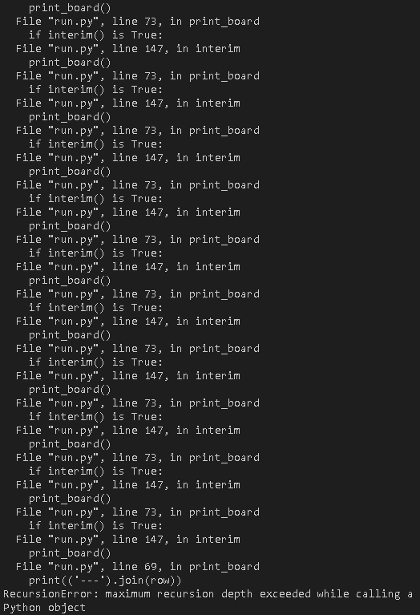
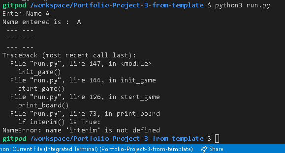

# Introduction

This project is a tic tac toe game.
The developmenmt is documnented here and other markdown files are linked out to also.

# Deployed Project
- Heroku Main Deployment [Portfolio_project_3_from_template Deployed on Heroku](https://portfolio-project-3-tictactoe.herokuapp.com/)
	- github secondary deployment [GitHub Deployment](https://coder731.github.io/Portfolio-Project-3-from-template/)

# User Stories

This is designed for users to play tic tac toe.

It also documents:

	- lessons learned about python during the project
	- bugs encountered during development
	- the approach taken building first python project

# Features

- board, shown as game is progressing
	- running Deployed on Heroku

Heroku Deployed Project Running: game starting:

Heroku Deployed Project Running: mid-game:

	- running in terminal

- The board displayed to the user is a list of lists
## Image of board

# Tech stack
- python
	- [python.org](https://www.python.org/dev/peps/pep-0008/)
	- [Python on pythontutor.com](http://pythontutor.com/visualize.html#mode=edit)
	- [PEP8 Python code linter](https://pep8.org/)
	- [PEP8 online](pep8online.com)
- [Heroku](https://dashboard.heroku.com/apps)
	- [about Heroku](https://en.wikipedia.org/wiki/Heroku)
- [Emmet — the essential toolkit for web-developers](https://emmet.io/)
- [gitpod](https://gitpod.io/workspaces/)
	- [gitpod was originally released based on Eclipse Theia, but now uses Visual Studio](https://en.wikipedia.org/wiki/Eclipse_Theia#Usage)
	- [gitpod.io/about](https://www.gitpod.io/about/)
- [GitHub](https://github.com/)
	- [about GitHub](https://en.wikipedia.org/wiki/GitHub)
	- [github.com/about](https://github.com/about)
- Visual Studio Code

# Testing
- [TESTING](assets/documentation/supplementary_files_to_main_readme_file/testing_files/TESTING.md)
- [TESTING2](assets/documentation/supplementary_files_to_main_readme_file/testing_files/testing2_excluded_debug_files/TESTING2_excluded_debug.md)
- [TESTING3](assets/documentation/supplementary_files_to_main_readme_file/testing_files/TESTING3.md)
- [TESTING4](assets/documentation/supplementary_files_to_main_readme_file/testing_files/TESTING4.md)

## Validation

# Deployment
- Used template from Code Institute to allow python backend application to have a pre-built front-end to allow ease of running for the user
- Followed Code Institute instructions for Deployment
- updated requirements.txt file using terminal command:
	- pip3 freeze > requirements.txt
	- Heroku uses this file to deploy
- used requirements.txt file to record dependencies
- Heroku was used to deploy site
	- navigated to [Heroku dashboard](https://dashboard.heroku.com/apps)
	- Clicked on Create new app
	- named app uniquely
	-set region to Europe
	- Clicked create app
	- Used Settings tab to set settings
		- Clicked Reveal Config vars 
				- to set configuration variables
				- no private credentials needed to set up project as no CREDS.json file used
			- Variable PORT was set to 8000
		- Clicked Add buildpack to add further dependencies outside of requirements.txt file
			- Clicked python and Save changes
				- path: heroku/python
			- Clicked nodejs and Save changes
				- path: heroku/nodejs
	- Then used Deploy tab
		- Selected GitHub from deployment method
			- Clicked Connect to GitHub
			- searched for GitHub Repository name
				- Clicked Search and Connect
				- Used Manual Deploy

					- Periodically redeployed during development
		- Clicked View to go to deployed link
	- Run Program button present, but program started automatically
	- tictactoe running on Heroku:

## secondary github deployment

Step a: Click Settings:

Step b: Settings clicked:

Step c: Scroll down to GitHub Pages
	- Click:
		- "Check it out here!":

Step d: Select main Branch and root Folder
	- Click Save
	- Click on link after:
		- "Your site is published at"
	- Result:

Step e: Site Deployed on GitHub
	- Has link to Heroku deployed site also.

[GitHub Deployment](https://coder731.github.io/Portfolio-Project-3-from-template/)

# Deployed Project
- [Portfolio_project_3_from_template Deployed on Heroku](https://portfolio-project-3-tictactoe.herokuapp.com/)

# Acknowledgement
Many thanks to my mentor, Akshat Garg, for all the help on this and previous portfolio projects
https://github.com/akshatnitd

- link to [References](#README.md/Referneces) in README
- link to [REFERENCES_unformatted.md](assets/documentation/supplementary_files_to_main_readme_file/non_testing_supplementary_files_for_main_readme/REFERENCES_unformatted.md)

# Deployed Project:
- [portfolio-project-3-tictactoe](https://dashboard.heroku.com/apps/portfolio-project-3-tictactoe)

# run.py
- Application runs from run.py in root folder

# Checking for omissions from README

## Checking any missing parts versus Code-Institute-Solutions / SampleREADME
-[Code-Institute-Solutions / SampleREADME](https://github.com/Code-Institute-Solutions/SampleREADME)

## Checking any missing parts versus Love Running Template README
- [Link to Love Running Template README](https://github.com/Code-Institute-Solutions/readme-template)

## For Love Math README see gitpod-full-template README
- [gitpod-full-template README](https://github.com/Code-Institute-Org/gitpod-full-template)

## Checking any missing parts versus Love Sandwiches Template README
- [Link to Love Sandwiches Template README](https://github.com/Code-Institute-Solutions/love-sandwiches-p5-sourcecode/blob/master/05-deployment/01-deployment-part-1/README.md)

## Checking any missing parts versus Code-Institute-Org / python-essentials-template
- [Code-Institute-Org / python-essentials-template](https://github.com/Code-Institute-Org/python-essentials-template)

## Checking any missing parts versus Portfolio_Project_1
- [Link to Portfolio_Project_1 README](https://github.com/Coder731/Portfolio_Project_1/blob/main/README.md)

## Checking any missing parts versus Portfolio_Project_2
- [Link to Portfolio_Project_2 README](https://github.com/Coder731/Profile_Project_2/blob/main/README.md)

# Other Notes

## Multiple README files Explanation
There are currently 3 README files:
1. This one, README.md is the main README here in root directory
2. [README2.md](readme_for_template/README2.md) is the second README, which comes with the [Template](https://github.com/Code-Institute-Org/python-essentials-template) used
3. [README3_from_original_repo_pre_template.md](readme_2_and_3/readme3_from_original_repo_pre_template/README3_from_original_repo_pre_template.md) is the third README, which comes from the original [Portfolio_Project_3](readme_2_and_3/readme3_from_original_repo_pre_template/README3_from_original_repo_pre_template.md) Repository used before restarting using [Template](https://github.com/Code-Institute-Org/python-essentials-template) to allow front end use and display of python application

## Other .md markdown files in project

- [README2.md](assets/documentation/readme_2_and_3/template_readme2/README2.md)
- [README3_from_original_repo_pre_template.md](assets/documentation/readme_2_and_3/readme3_from_original_repo_pre_template/README3_from_original_repo_pre_template.md)
- [CODE_VISUALISATION.md](assets/documentation/supplementary_files_to_main_readme_file/non_testing_supplementary_files_for_main_readme/CODE_VISUALISATION.md)
- [DEBUG.md](assets/documentation/supplementary_files_to_main_readme_file/non_testing_supplementary_files_for_main_readme/DEBUG.md)
- [DEVELOPMENT.md](assets/documentation/supplementary_files_to_main_readme_file/non_testing_supplementary_files_for_main_readme/DEVELOPMENT.md)
- [NOTES.md](assets/documentation/supplementary_files_to_main_readme_file/non_testing_supplementary_files_for_main_readme/NOTES.md)
- [PLAN.md](assets/documentation/supplementary_files_to_main_readme_file/non_testing_supplementary_files_for_main_readme/PLAN.md)
- [REFERENCES_unformatted.md](assets/documentation/supplementary_files_to_main_readme_file/non_testing_supplementary_files_for_main_readme/REFERENCES_unformatted.md)
- [TESTING.md](assets/documentation/supplementary_files_to_main_readme_file/testing_files/TESTING.md)
- [TESTING2_excluded_debug.md](assets/documentation/supplementary_files_to_main_readme_file/testing_files/testing2_excluded_debug_files/TESTING2_excluded_debug.md)
- [TESTING3.md](assets/documentation/supplementary_files_to_main_readme_file/testing_files/TESTING3.md)
- [TESTING4.md](assets/documentation/supplementary_files_to_main_readme_file/testing_files/TESTING4.md)

## file locations of markdown .md files not in root folder

- [TESTING2_excluded_debug.md](assets/documentation/TESTING2_excluded_debug_files/TESTING2_excluded_debug.md)
- [README2.md](readme_for_template/README2.md)
- [README3_from_original_repo_pre_template.md](readme_for_template/README3_from_original_repo_pre_template/README3_from_original_repo_pre_template.md)

# Necessary Elements (migrated from [original Portfolio_Project_3 Repository pre template](https://github.com/Coder731/Portfolio_Project_3/blob/main/README.md#necessary-elements--1))
- PEP8 (End)_ _DONE
- functionality works as per the critical project objectives (End)_ _DONE
- comments, indent, consistent-meaning-naming-conventions (Process)_ _DONE

- Write code that handles empty or invalid input data (During)_ _DONE
- Clearly separate and identify code written for the application and code from external sources (e.g. libraries or tutorials) (Comments)_ _DONE
- consistent flow of logic and data, well defined granular functions (During)_ _DONE
- standard programming constructs: repetition, selection, functions, composition, modules, aggregated data (arrays, lists) (During) _DONE
- standard programming constructs: flow control, iteration, selection, functions, object-oriented programming, data structures - as appropriate (During)_ _DONE
- exception/error handling (During)_ _DONE

- external Python libraries where necessary (During) _DONE
- data model / processing _DONE
- code that queries and manipulates data _DONE
- github _DONE
- basic manual testing procedures for code validation (pep8online.com)_ _in progress
- deploy command-line application _DONE
- no commented code (Process / End)_ _DONE
- deploy to github pages __NOTE_DONE

## Development Continued

### Phase 0
Error present in terminal: 
- flake8 error E231 
- Fixed by using: [flake8 error E231 after a successful black run #1289](https://github.com/psf/black/issues/1289)
    - step 1: try to run black run.py
        - black not installed
    - step 2: pip3 install black 
    - step 3: black run.py
    - step 4: flake8 run.py

#### Error with gitpod.yml
- gitpod.yml ms-toolsai.jupyter extension is not synced, but not added in .gitpod.yml
- fixed by clicking on i in image in gitpod.yml to see error message, and addressing this.

### Phase 1
print statement is now running

### Phase 2
run:
pip3 freeze > requirements.txt
this adds the following dependencies to the requirements.txt file:

black==21.8b0
click==8.0.1
pathspec==0.9.0
regex==2021.8.28
tomli==1.2.1

### Phase 3 Board Display
- Add vertical lines (pipes) between squares horizontally
- Add underscores between squares vertically

### Phase 4 Display two sequential boards
- Board A
    - Present choice to user
- Board B
    - Display user choice

## Debugging
 ### Bug Brackets displaying on board
 Description
 - Brackets displaying
 Solution
 - Display board without brackets.

## Checking win condition 
### Vertical three in a line
Image showing debugging using python tutor of subset of code dealing with checking for three O's in a line vertically.

Shows program exits as expected for three O's vertically in line, indicating this piece of code has been fixed.

Same python tutor debugging step as above, but showing the part of is game over function checking for three in a line vertically.

### Complex Bug
Keywords for Error:
- Flake Error with Syntax Error with conversion of values List to Dictionary 

Flake Error:
Erorr Message:
SyntaxError: invalid syntax
Erorr Detail:
- {
	"resource": "/workspace/Portfolio-Project-3-from-template/run.py",
	"owner": "python",
	"code": "E999",
	"severity": 8,
	"message": "SyntaxError: invalid syntax",
	"source": "flake8",
	"startLineNumber": 27,
	"startColumn": 12,
	"endLineNumber": 27,
	"endColumn": 12
}
Error Further Information:
- Error appears in Problems Section of Gitpod/VSCode IDE beside  Output and Terminal tabs

Attempted Solution:
- Searched error

### RecursionError Bug [Resolved]
Problem: maximum recursion depth exceeded
Steps to recreate:
Trying to print final board after a player wins
	- added two functions:
		- interim
		  and
		- print_final_board
	- added two if conditons from print_final_board to print_board
	- ran program run.py in terminal
Image of feedback from terminal:

- recursion error

- Attempted Solution
	- Removed interim and print_final_board functions
	- left extra if statements in print_board function
- Same error message but slightly different output

- recursion error two 

- Debugging EOFError 

- Potential Solution
	- Could use try catch exception handling
- Next Step
	- Cut interim function
New error: interim function name error

- Next Step:
	- Remove all interim function calls
- Bug has been Resolved

### Final board not displaying after win Bug [Resolved]
Error:
	- SyntaxError: name 'game_is_over' is assigned to before global declaration
Attempted Solution:
	- Searched Error

Result:
Reference:
- [SyntaxWarning: name 'item' is assigned to before global declaration global item](https://stackoverflow.com/questions/53528532/syntaxwarning-name-item-is-assigned-to-before-global-declaration-global-item)
- Reference recommendation:
	- Remove global keyword from within loop
Resolved

### Board not Displaying after win Bug [Resolved]
Bug:
- Board does not display after winning
Solution:
- Add game_is_over variable set to False
- For any of the three loops in is_game_over() function, 
	if condition is satisfied,
	- set game_is_over variable to True
	- call print_board() function

## Note on Development
- Began with run py 
- With certain changes, run py file was duplicated and number incremented by one
- One reason was to allow for development from run 10 py to run14 py
	- and then combine new version of line check from that subset of code being worked on with original code
	- to form run15 recombine py
- There is probably a better way maybe involving using git branch and git merge but I am not familiar with these.

## Unsolved Errors
- Potentially in code for run16 py and previous versions x and y should be reversed, but for the sake of time these will be left as is.
- run11 py has 2 problems with the linter

## References 
### Tutorials
- Board setup [Python for absolute beginners 2019 - TIC TAC TOE project (+Special Appearance!)](https://youtu.be/BHh654_7Cmw?t=562)

## Board setup
- [Tic-tac-toe using Python](https://www.askpython.com/python/examples/tic-tac-toe-using-python)

### Print statements
- \t [python : comma in print as "\t"](https://stackoverflow.com/a/13433069)

## Miscellaneous
- Vertical Line [Enter "vertical bar" (or "pipe symbol") in Windows](https://apple.stackexchange.com/questions/52647/enter-vertical-bar-or-pipe-symbol-in-windows)

## TicTacToe References
- [The Classic Tic-Tac-Toe Game in Python 3](https://medium.com/byte-tales/the-classic-tic-tac-toe-game-in-python-3-1427c68b8874)
- [Invent Your Own Computer Games with Python by Al Sweigart / Chapter 10 - Tic-Tac-Toe](https://inventwithpython.com/invent4thed/chapter10.html)

## Flake Reference
- [flake8](https://pypi.org/project/flake8/)

## Own previous projects used
- [Portfolio_Project_1](https://github.com/Coder731/Portfolio_Project_1)
- [Profile_Project_2](https://github.com/Coder731/Profile_Project_2)

## Pevious version of this Project (before using template)
- [Portfolio_Project_3](https://github.com/Coder731/Portfolio_Project_3)

### References from old version of Portfolio_Project_3 
- [Python for absolute beginners 2019 - TIC TAC TOE project (+Special Appearance!)](https://youtu.be/BHh654_7Cmw?t=1065)

## Stack OverFlow Resources Used
- Used print f string to display request for user input [Tic tac toe program user input correction needed](https://stackoverflow.com/questions/24973656/tic-tac-toe-program-user-input-correction-needed)

### Code Institute Resources .

- [Code Institute Google Sheets Template used from love-sandwiches Walkthrough Project](https://docs.google.com/spreadsheets/d/1PeSOxAPuFnZlonXcPCMv5msKfiISvuaEJXkcrs-HsVw/edit#gid=1680754323)
    #### Code Institute Internal LMS Notes Used
    - Taking User Input / Reading Data From a Use

## Templates used
- [Code-Institute-Org/python-essentials-template](https://github.com/Code-Institute-Org/python-essentials-template)

## Miscellaneous References
- [Emmet — the essential toolkit for web-developers](https://emmet.io/)

- [python.org](https://www.python.org/dev/peps/pep-0008/)
- [Python on pythontutor.com](http://pythontutor.com/visualize.html#mode=edit)
#### PEP8

- [PEP8 Python code linter](https://pep8.org/)

#### pep8online
- [PEP8 online](pep8online.com)
